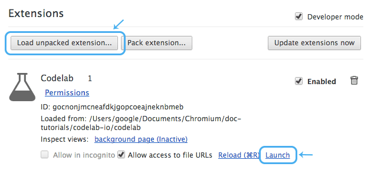
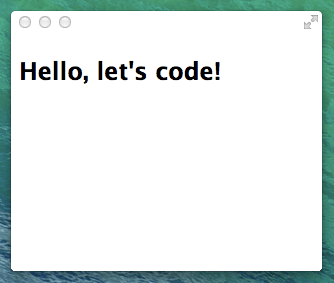
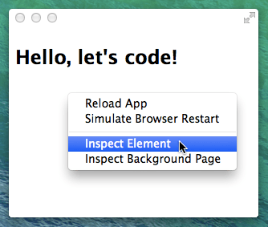

通过这些步骤, 你将学习到:

- Chrome App 的基本构建模块, 包括`manifest` 和后台脚本.
- 如何安装, 运行和调试一个Chrome App.

估计完成这个步骤需要的时间: 10 分钟.

#### 熟悉一下Chrome Apps
一个Chrome App包含下面的组件:

- `manifest` 文件指定了你程序的一些元信息, 该文件告诉Chrome关于你app的一些信息, 如何启动它, 需要哪些额外的权限.
- `事件页面` 也叫作后台脚本, 负责管理程序的生命周期, 后台脚本就是为app的一些事件注册监听器比如app窗口的启动和关闭.
- 全部 `代码文件` 必须被打包在App中, 这包括HTML, JavaScript, CSS和本地原生的模块.
- `资源文件` 包括app的icon, 也应该被打包在app中.

#### 创建manifest
打开一个你喜欢的代码/文本编辑器, 创建一个名为`manifest.json` 的文件, 编写以下内容:
```
{
	"manifest_version": 2,
	"name": "Codelab",
	"version": "1",
	"icons": {
		"128": "icon_128.png"
	},
	"permissions": [],
	"app": {
		"background": {
			"scripts": ["background.js"]
		}
	},
	"minimum_chrome_version": "28"
}
```
注意这个`manifest` 文件描述了一个叫`background.js` 的后台脚本, 在后面你应该创建这个脚本.
```
"background": {
  "scripts": ["background.js"]
}
```
在后面我们将为程序提供一个icon:
```
"icons": {
  "128": "icon_128.png"
},
```

##### 创建后台脚本
创建以下文件并保存为`background.js`:
```
/**
 * Listens for the app launching then creates the window
 *
 * @see http://developer.chrome.com/apps/app.window.html
 */
chrome.app.runtime.onLaunched.addListener(function() {
  chrome.app.window.create('index.html', {
    id: 'main',
    bounds: { width: 620, height: 500 }
  });
});
```
这个后台脚本只是等待` chrome.app.runtime.onLaunched` 被触发以及执行里面的回调函数:
```
chrome.app.runtime.onLaunched.addListener(function() {
	// ...
});
```
当Chrome App启动时, `chrome.app.window.create()`, 将会使用基本的HTML页面(index.html)作为资源来创建一个窗口, 下一步就是创建HTML视图: 
```
chrome.app.window.create('index.html', {
	id: 'main',
	bounds: {width: 620, height: 500}
});
```
后台脚本可能包含其他的监听器, 窗口, 发送信息和加载数据---这些都是通过事件页面来管理程序的.

##### 创建HTML视图
创建一个名为`index.html` 的文件用于在屏幕上显示一条`hello world` 的信息: 
```
<!DOCTYPE html>
<html>
	<head>
		<meta charset="utf-8"></meta>
	</head>
	<body>
		<h1>Hello, let's code!</h1>
	</body>
</html>
```
如同其他的web页面一样, 你可以在这个HTML文件中包含JavaScript和CSS以及其他的一些资源.

##### 为App添加icon
右击保存下面128x128的图片到你的项目文件夹下, 文件名为`icon_128.png`:


你将使用这张图片作为你App的图标, 用户将会在启动器里通过这个图标来启动你的程序.

##### 确认你已经创建了所有的文件
在你的项目文件夹中应该包含下面4个文件:


#### 在开发者模式下安装你的App
通过开发者模式快速的来加载并启动你的App而并不需要完成App的发布包.

0. 在Chrome地址栏访问`chrome://extensions`
1. 选中开发者模式复选框.


2. 点击加载已解压的扩展程序.
3. 通过文件选择对话框到你的App项目文件夹选择并加载你的App.



#### 启动你完成的hello world程序
通过加载你没有打包的App项目, 点击你安装完后App的启动按钮, 一个独立的窗口将会被打开:



恭喜你, 成功创建了一个新的Chrome App!

#### 用开发者工具来调试你的App
你可以使用Chrome开发者工具来检查, 调试、审核和测试你的应用程序就像你在一个常规的web页面一样.

在你修改代码并重新加载你的App之后(右击->重新加载应用), 在开发者工具控制台下检查任何错误(右击->审查元素).



(我们将会在Step 3中讲到审查背景页面)

在开发者工具的JavaScript控制台下可以访问用于应用程序中相同的api, 你可以很容易的来测试调用api在你写入代码之前:


	