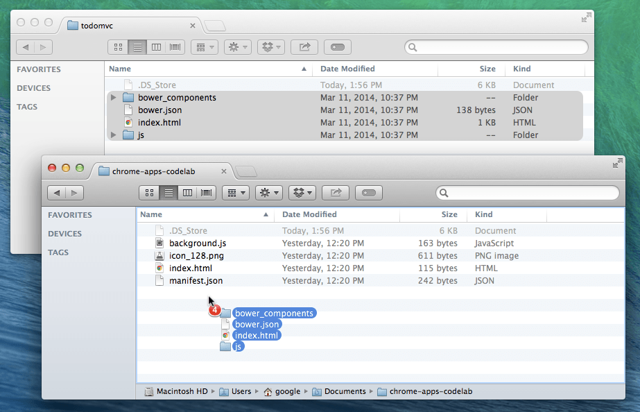
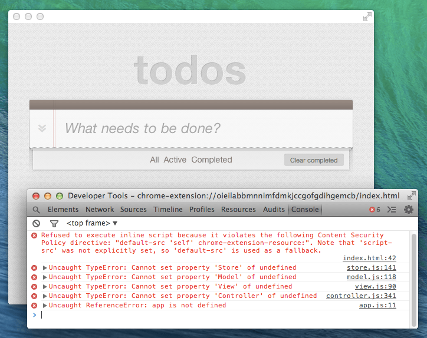
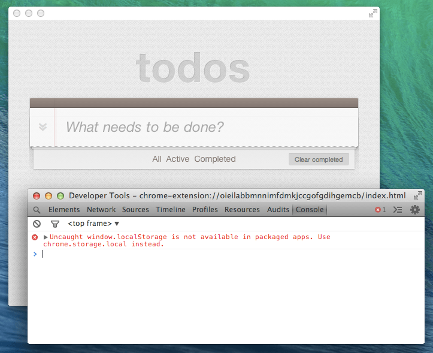
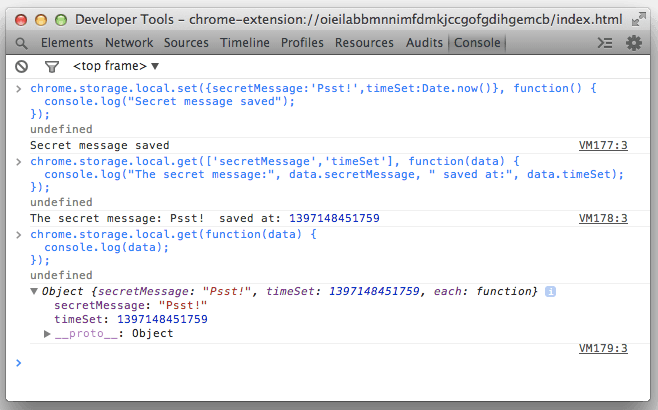
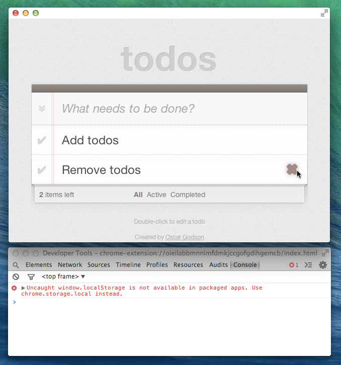

如果你想从这里开始, 找到[上一步步骤的代码](https://github.com/mangini/io13-codelab/archive/master.zip) 在cheat_code > solution_for_step1.

---

通过这一个步骤你将学习到:

- 如何在Chrome App平台下适应已经存在的Web应用程序.
- 如何让你的app脚本遵守内容安全策略CSP.
- 怎样通过`chrome.storage.local` 来实现本地存储.

完成这个步骤大概需要的时间: 20分钟.

#### 导入一个现有的程序Todo
作为项目的起点, 你需要导入[TodoMVC](http://todomvc.com/)中的[vanilla JavaScript version](http://todomvc.com/vanilla-examples/vanillajs/) 到你的项目作为基准.

我们已经包括TodoMVC应用程序的一个版本, [参考代码](https://github.com/mangini/io13-codelab/archive/master.zip)打包在TodoMVC文件夹, 复制todomvc文件夹下的所有文件(包括文件夹)到你的项目目录下.



你将被告知存在同名文件index.html, 同意替换掉它.


在你的项目目录下应该有下面的文件目录结构:


其中被选中的部分来自todomvc文件夹.

现在重新加载你的App(右击->重新加载应用). 你应该可以看见基本的UI了, 但是还不能添加待办事项.

#### 使脚本兼容内容安全策略
打开开发者工具控制台(右击->审查元素, 然后选择Console选项卡), 你将看到一个关于不能执行内联脚本的错误信息.



我们通过使app兼容CSP(内容安全策略, 以后都使用CSP来代替)来解决这个问题. 使用了内联脚本是违背CSP的最常见的一种情况之一. 例如通过内联脚本的事件处理来操作DOM的属性(e.g. `csp-console-error.png`) 和在HTML内容里面使用了`<script>` 标签.

解决方案非常的简单: 将内联内容保存到一个新的文件.

0. 在靠近`index.html` 文件的底部, 删除其中的内联JavaScript代码并重新保存到`js/bootstrap.js`:
```
<script src="bower_components/director/build/director.js"></script>
<script>//这一内联脚本是不允许的
  // Bootstrap app data
  window.app = {};
</script>
<script src="js/bootstrap.js"></script>
<script src="js/helpers.js"></script>
<script src="js/store.js"></script>
```
注意: 在移除内联代码并新建js文件后, 请在index.html中加入`<script src="js/bootstrap.js"></script>` .

1. 在js文件夹中新建一个名为`bootstrap.js` 的文件, 将之前的js代码保存到此文件中:
```
// Bootstrap app data
window.app = {};
```
重启你的app, 但是它仍然不能正常的工作, 不过离完成它已经不远了.

#### 将localStorage转换为chrome.storage.local
现在重新打开开发者工具的Console你会发现之前的错误已经没了. 但是, 现在又有了一个新的问题, `window. localStorage` 不能使用.



Chrome App是不支持`localStorage` 的, 因为`localStorage` 是同步的. 在单线程同步访问资源会导致I/O线程阻塞, 这会导致app在运行的时候长时间无法响应.

Chrome App有一个与其功能相同的api通过异步来实现存储对象, 通过对象序列化的方式避免了object->string->object转换过程所浪费的时间.

找到你app代码中的错误信息, 并将它`localStorage` 转换为`chrome.storage.local`.

##### 更新App得权限
为了使用`chrome.storage.local` 你需要拥有`storage` 权限. 在manifest.json文件permissions数组中添加storage:
```
"permissions": ["storage"], 
```

##### 学习如何使用local.storage.set()和local'.storage.get()
在Todo的item保存和检索过程中, 你需要知道如何使用`chrome.storage` API中的`set()` 和 `get()` 方法.

`set()` 方法第一个参数接收一个以键值对形式的对象, 第二个参数是一个可选的回调函数, 例如:
```
chrome.storage.local.set({secretMessage:'Psst!',timeSet:Date.now()}, function() {
  console.log("Secret message saved");
});
```

`get()` 方法接收的第一个参数是可选的, 是你想检索数据的key, 一个键可以作为字符串来传递, 多个键可以组成一个字符串数组或者字典对象.

第二个参数是一个必须的回调函数, 返回的对象是使用第一个参数的key去请求访问存储对象中的值, 例如:
```
chrome.storage.local.get(['secretMessage','timeSet'], function(data) {
  console.log("The secret message:", data.secretMessage, "saved at:", data.timeSet);
});
```

如果你想获取当前存储对象里面全部值, 你可以省略`get()` 方法的第一个参数:
```
chrome.storage.local.get(function(data) {
  console.log(data);
});
```

不像`localStorage` 你不能在开发者工具面板的`Resources`里面查看本地存储的条目. 然而你可以通过JavaScript Console与`chrome.stroage` 进行交互, 就像这样:



##### 预览需要作出改变的API
Todo大部分剩下的步骤是修改一些API的调用, 改变当前所有使用了`localStorage` 的地方, 虽然耗时且容易出错, 但是这是必须的.

> 这个Codelab最大的乐趣莫过于你自己重新实现一下`cheat_code/solution_for_step_2` 中的 store.js, controller.js, model.js.
>  
>  如果你完成了它, 你将很清楚的知道里面发生了什么样的改变.

`localStorage` 与 `chrome.storage.local` 之间最大的差异是因为`chrome.storage.local` 的异步性:

- 并不是因为`localStorage` 使用起来比较方便, 而是你需要使用`chrome.storage.local` 来实现可选的回调
```
var data = { todos: [] };
localStorage[dbName] = JSON.stringify(data);
```
对比
```
var storage = {};
storage[dbName] = { todos: [] };
chrome.storage.local.set( storage, function() {
  // optional callback
});
```

- 不是因为你可以直接的访问`localStorage[myStorageName]` , 而是你可以通过`chrome.storage.local.get(myStorageName,function(storage){...}) ` 的方式访问数据并在回调函数里解析返回的`storage ` 对象:
```
var todos = JSON.parse(localStorage[dbName]).todos;
```
对比:
```
chrome.storage.local.get(dbName, function(storage) {
  var todos = storage[dbName].todos;
});
```

- `.bind(this)` 用于所有的回调函数确保这个指的是这个Storage的原型:
```
function Store() {
  this.scope = 'inside Store';
  chrome.storage.local.set( {}, function() {
    console.log(this.scope); // outputs: 'undefined'
  });
}
new Store();
```
对比:
```
function Store() {
  this.scope = 'inside Store';
  chrome.storage.local.set( {}, function() {
    console.log(this.scope); // outputs: 'inside Store'
  }.bind(this));
}
new Store();
```
记住这些关键差异在我们以下检索、保存和删除todo项目在的部分中.

##### 获取任务列表
0. `Store` 的构造函数负责初始化app中来自外部的Todo条目数据. 该方法首先会检查是否存在外部数据, 如果不存在则创建一个关于todos空的数组到存储空间以保证程序在运行的时候不会出现读取错误.

在js/store.js中, 将构造函数中使用的`localStorage` 方法转换为`chrome.storage.local` :
```
function Store(name, callback) {
  var data;
  var dbName;

  callback = callback || function () {};
  
  dbName = this._dbName = name;

  //要被替换的代码段
  /*
  if (!localStorage[dbName]) {
    data = {
      todos: []
    };
    localStorage[dbName] = JSON.stringify(data);
  }
  callback.call(this, JSON.parse(localStorage[dbName]));
  */
  
  //下面的代码替换上面注释掉的代码
  chrome.storage.local.get(dbName, function(storage) {
    if ( dbName in storage ) {
      callback.call(this, storage[dbName].todos);
    } else {
      storage = {};
      storage[dbName] = { todos: [] };
      chrome.storage.local.set( storage, function() {
        callback.call(this, storage[dbName].todos);
      }.bind(this));
    }
  }.bind(this));
}
```

1. `find()` 方法用来从,模型中读取数据, 返回的结果是根据你在"All", "Active", "Completed"中的筛选.
转换 `find()` 方法中的`chrome.storage.local` :
```
Store.prototype.find = function (query, callback) {
    if (!callback) {
      return;
    }

    /*var todos = JSON.parse(localStorage[this._dbName]).todos;

    callback.call(this, todos.filter(function (todo) {
      for (var q in query) {
        return query[q] === todo[q];
      }
    }));*/

    chrome.storage.local.get(this._dbName, function(storage) {
    var todos = storage[this._dbName].todos.filter(function (todo) {  
      for (var q in query) {
         return query[q] === todo[q];
      }
      });
    callback.call(this, todos);
    }.bind(this));
  };
```

2. 转换类似于`find(), findAll()` 的方法用于从模型中获得数据的`localStorage` 使用`chrome.storage.local`:
```
Store.prototype.findAll = function (callback) {
    /*callback = callback || function () {};
    callback.call(this, JSON.parse(localStorage[this._dbName]).todos);*/
    chrome.storage.local.get(this._dbName, function(storage) {
    var todos = storage[this._dbName] && storage[this._dbName].todos || [];
    callback.call(this, todos);
    }.bind(this));
  };
```

##### 保存items
当前的`save()` 方法提出了一个新的问题,  这取决于两个异步操作(set和get)作用于单次存储的JSON, 任何超过一个的批量更新, 比如让所有的item都变成完成状态, 会导致数据称为读取在写入之后的危险. 如果我们使用一个更合适的数据库, 这样的事情就不会发生, 比如IndexedDB, 但是我们要尽量减少本次codelab的工作量.

我们有多种方式来解决他, 我们将通过这次机会来轻微的重构`save()` 函数来实现todo id的一次性更新.

0. 首先, 将`save()` 函数已有的内容包含在`chrome.storage.local.get()` 回调函数中:
```
Store.prototype.save = function (id, updateData, callback) {
  chrome.storage.local.get(this._dbName, function(storage) {
    var data = JSON.parse(localStorage[this._dbName]);
    // ...
    if (typeof id !== 'object') {
      // ...
    }else {
      // ...
    }
  }.bind(this));
};
``` 

1. 将所有的`localStorage`实例替换为`chrome.storage.local`:
```
Store.prototype.save = function (id, updateData, callback) {
    chrome.storage.local.get(this._dbName, function(storage) {
      var data = storage[this._dbName];
      var todos = data.todos;

      callback = callback || function () {};

      // If an ID was actually given, find the item and update each property
      if (typeof id !== 'object') {
        for (var i = 0; i < todos.length; i++) {
          if (todos[i].id == id) {
            for (var x in updateData) {
              todos[i][x] = updateData[x];
            }
          }
        }

        /*chrome.storage.local[this._dbName] = JSON.stringify(data);
        callback.call(this, JSON.parse(chrome.storage.local[this._dbName]).todos);*/
        chrome.storage.local.set(storage, function() {
        chrome.storage.local.get(this._dbName, function(storage) {
            callback.call(this, storage[this._dbName].todos);
          }.bind(this));
        }.bind(this));
      } else {
        callback = updateData;

        updateData = id;

        // Generate an ID
        updateData.id = new Date().getTime();

        todos.push(updateData);
        /*chrome.storage.local[this._dbName] = JSON.stringify(data);
        callback.call(this, [updateData]);*/
        chrome.storage.local.set(storage, function() {
          callback.call(this, [updateData]);
        }.bind(this));
      }
    }.bind(this);
  };
```

2. 然后更新逻辑, 操作数组而不是单个item:
```
Store.prototype.save = function (id, updateData, callback) {
  chrome.storage.local.get(this._dbName, function(storage) {
    var data = storage[this._dbName];
    var todos = data.todos;

    callback = callback || function () {};

    // If an ID was actually given, find the item and update each property
    if ( typeof id !== 'object' || Array.isArray(id) ) {
      var ids = [].concat( id );
      ids.forEach(function(id) {
        for (var i = 0; i < todos.length; i++) {
          if (todos[i].id == id) {
            for (var x in updateData) {
              todos[i][x] = updateData[x];
            }
          }
        }
      });

      chrome.storage.local.set(storage, function() {
        chrome.storage.local.get(this._dbName, function(storage) {
          callback.call(this, storage[this._dbName].todos);
        }.bind(this));
      }.bind(this));
    } else {
      callback = updateData;

      updateData = id;

      // Generate an ID
      updateData.id = new Date().getTime();

      todos.push(updateData);
      chrome.storage.local.set(storage, function() {
        callback.call(this, [updateData]);
      }.bind(this));
    }
  }.bind(this));
};
```

##### 标记一个item完成
现在app操作的是数组了, 你需要改变程序, 当用户点击了`Clear completed` 按钮:

0. 在`controller.js` , 更新`toggleAll()` 函数调用`toggleComplete()` 一次关于item的数组, 而不是将item一个一个的标记完成, 同时删除调用`_filter()` 因为你会调整`toggleComplete_filter()` 函数:
```
Controller.prototype.toggleAll = function (e) {
    var completed = e.target.checked ? 1 : 0;
    var query = 0;
    if (completed === 0) {
      query = 1;
    }
    this.model.read({ completed: query }, function (data) {
      var ids = [];
      data.forEach(function (item) {
        this.toggleComplete(item.id, e.target, true);
        ids.push(item.id);
      }.bind(this));
    }.bind(this));
  };
```

1. 现在更新toggleComplete()接受一个todo或待办事项的数组, 这包括移动filter()到update(), 而不是外面.
```
Controller.prototype.toggleComplete = function (ids, checkbox, silent) {
  var completed = checkbox.checked ? 1 : 0;
  this.model.update(ids, { completed: completed }, function () {
    if ( ids.constructor != Array ) {
      ids = [ ids ];
    }
    ids.forEach( function(id) {
      var listItem = $$('[data-id="' + id + '"]');
      
      if (!listItem) {
        return;
      }
      
      listItem.className = completed ? 'completed' : '';
      
      // In case it was toggled from an event and not by clicking the checkbox
      listItem.querySelector('input').checked = completed;
    });

    if (!silent) {
      this._filter();
    }

  }.bind(this));
};
```

##### 计算item的数目
当切换到异步的存储后, 这里还有一个小的bug, 就是当获取item的数目的时候, 你需要将计算器放到回调函数中去:
0. 在model.js更新`getCount()`函数, 使其接收一个回调:
```
Model.prototype.getCount = function (callback) {
  var todos = {
    active: 0,
    completed: 0,
    total: 0
  };
  this.storage.findAll(function (data) {
    data.each(function (todo) {
      if (todo.completed === 1) {
        todos.completed++;
      } else {
        todos.active++;
      }
      todos.total++;
    });
    if (callback) callback(todos);
   });
  };
```

1. 返回到controller.js, 更新_updateCount()函数, 使用异步的getCount()如你之前的步骤:
```
Controller.prototype._updateCount = function () {
    this.model.getCount(function(todos) {
      this.$todoItemCounter.innerHTML = this.view.itemCounter(todos.active);
      
      this.$clearCompleted.innerHTML = this.view.clearCompletedButton(todos.completed);
      this.$clearCompleted.style.display = todos.completed > 0 ? 'block' : 'none';
      
      this.$toggleAll.checked = todos.completed === todos.total;
      
      this._toggleFrame(todos);
    }.bind(this));

  };
```
直到这一步差不多就快完成了, 重启你的app, 你可以在todo里面插入数据且控制台不会产生错误了.

##### 移除item项
现在你的app可以保存item了, 这即将完成, 但是当你移除item的时候Console还是会产生错误:



0. 在store.js将所有的localStorage实例替换为chrome.storage.local:
a) 首先, 将`remove()`的函数体放在`get()`回调函数中:
```
Store.prototype.remove = function (id, callback) {
  chrome.storage.local.get(this._dbName, function(storage) {
    var data = JSON.parse(localStorage[this._dbName]);
    var todos = data.todos;
    
    for (var i = 0; i < todos.length; i++) {
      if (todos[i].id == id) {
        todos.splice(i, 1);
        break;
      }
    }
    
    localStorage[this._dbName] = JSON.stringify(data);
    callback.call(this, JSON.parse(localStorage[this._dbName]).todos);
  }.bind(this));
};
```

b) 然后把内容放在`get()`回调中:
```
Store.prototype.remove = function (id, callback) {
    chrome.storage.local.get(this._dbName, function(storage) {
      var data = storage[this._dbName];
      var todos = data.todos;

      for (var i = 0; i < todos.length; i++) {
        if (todos[i].id == id) {
          todos.splice(i, 1);
          break;
        }
      }

      chrome.storage.local.set(storage, function() {
        callback.call(this, todos);
      }.bind(this));
    }.bind(this));
  };
```

1. 之前在`save()`方法中存在的读取可能在写入操作之后的问题也会出现在你移除items的时候, 所以你需要更新一些地方来允许批处理你的todo列表:
a) 仍然在`store.js`中, 更新`remove()`:
```
Store.prototype.remove = function (id, callback) {
  chrome.storage.local.get(this._dbName, function(storage) {
    var data = storage[this._dbName];
    var todos = data.todos;

    var ids = [].concat(id);
    ids.forEach( function(id) {
      for (var i = 0; i < todos.length; i++) {
        if (todos[i].id == id) {
          todos.splice(i, 1);
          break;
        }
      }
    });

    chrome.storage.local.set(storage, function() {
      callback.call(this, todos);
    }.bind(this));
  }.bind(this));
};
```

b) 在`controller.js`
```
Controller.prototype.removeCompletedItems = function () {
  this.model.read({ completed: 1 }, function (data) {
    var ids = [];
    data.forEach(function (item) {
      ids.push(item.id);
    }.bind(this));
    this.removeItem(ids);
  }.bind(this));

  this._filter();
};
```

c) 最后, 仍然在`controller.js`, 改变`removeItem()`, 让他支持在DOM中一次性移除多个item, 还有移动`_filter()`让他在回调中调用:
```
Controller.prototype.removeItem = function (id) {
  this.model.remove(id, function () {
    var ids = [].concat(id);
    ids.forEach( function(id) {
      this.$todoList.removeChild($$('[data-id="' + id + '"]'));
    }.bind(this));
    this._filter();
  }.bind(this));
};
```

##### 清空Todo的item
在`store.js`中还有一个方法在使用`localStorage`:
```
Store.prototype.drop = function (callback) {
  localStorage[this._dbName] = JSON.stringify({todos: []});
  callback.call(this, JSON.parse(localStorage[this._dbName]).todos);
};
```
这个方法不能在这个app中调用, 如果你想有额外的挑战, 你可以尝试自己来实现. 提示: 你可以查看[chrome.storage.local.clear()](https://developer.chrome.com/apps/storage#method-StorageArea-remove)

#### 启动你的App
你已经完成了此次Codelab的Step 2, 现在你能使用完整的功能了. 注意每个步骤操作完成之后查看控制台的任何错误信息.