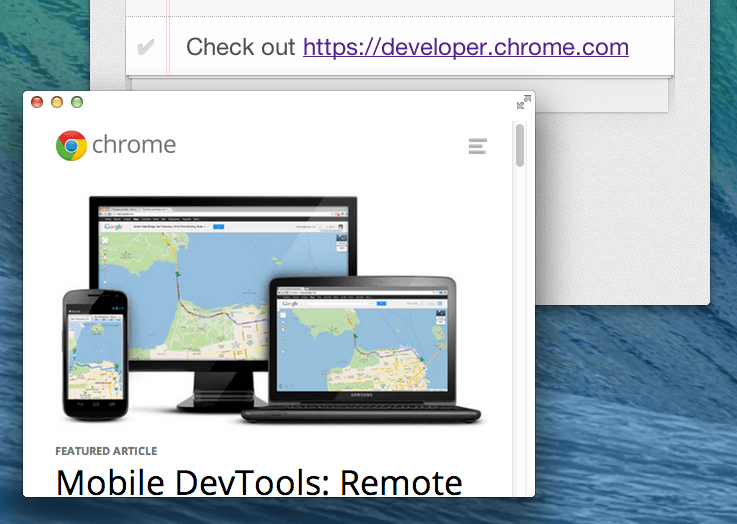
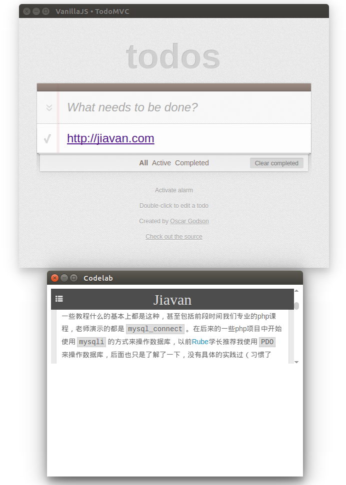

通过这个步骤你将学习到：
- 通过安全的沙箱方式将外部web内容显示在你的App内。

完成这个步骤大概需要的时间：10分钟

#### 了解webview标签
某些应用程序需要将外部web页面中的内容加载进app呈现给用户。例如一个查看新闻的App需要得到原始站点的页面格式以及图片，对于这些和其他类似的用法，Chrome App里面有一个自定义的html标签叫`webview`。



> webview通过沙箱来处理：封闭的Chrome应用程序(也称为“嵌入页面”)无法轻易访问webview加载DOM。你只能使用webview的API来与其交互。

##### 更新权限
在`manifest.json`文件添加webview权限：
```
"permissions": ["storage", "alarms", "notifications", "webview"],
```

##### 创建一个webview嵌入页面
创建一个名为`webview.html`的文件在你的项目根目录下，这是一个基本的网页文件用了webview标签：
```
<!DOCTYPE html>
<html>
<head>
  <meta charset="utf-8">
</head>
<body>
  <webview style="width: 100%; height: 100%;"></webview>
</body>
</html>
```

##### 解析URL
在`controller.js`的末尾增加一个名为`_parseForURLs`的函数：
```
Controller.prototype._getCurrentPage = function () {
    return document.location.hash.split('/')[1];
  };

  Controller.prototype._parseForURLs = function (text) {
    var re = /(https?:\/\/[^\s"<>,]+)/g;
    return text.replace(re, '<a href="$1" data-src="$1">$1</a>');
  };

  // Export to window
  window.app.Controller = Controller;
})(window);
```
每当一个字符串从“http://”或“https://”开始,创建一个HTML锚标记环绕URL。

##### 在item项里面添加超链接
在`controller.js`里面找到`showAll()`，更新showAll()使用_parseForURLs()方法来解析链接：
```
/**
 * An event to fire on load. Will get all items and display them in the
 * todo-list
 */
Controller.prototype.showAll = function () {
  this.model.read(function (data) {
    this.$todoList.innerHTML = this._parseForURLs(this.view.show(data));
  }.bind(this));
};
```
在`showActive()`和`showCompleted()`里面进行同样的操作：
```
/**
 * Renders all active tasks
 */
Controller.prototype.showActive = function () {
  this.model.read({ completed: 0 }, function (data) {
    this.$todoList.innerHTML = this._parseForURLs(this.view.show(data));
  }.bind(this));
};

/**
 * Renders all completed tasks
 */
Controller.prototype.showCompleted = function () {
  this.model.read({ completed: 1 }, function (data) {
    this.$todoList.innerHTML = this._parseForURLs(this.view.show(data));
  }.bind(this));
};
```
最后,添加_parseForURLs()到editItem():
```
Controller.prototype.editItem = function (id, label) {
  ...
  var onSaveHandler = function () {
    ...
      // Instead of re-rendering the whole view just update
      // this piece of it
      label.innerHTML = this._parseForURLs(value);
    ...
  }.bind(this);
  ...
}
```
仍在editItem(),修复代码,以便它使用innerText标签而不是innerHTML:
```
Controller.prototype.editItem = function (id, label) {
  ...
  // Get the innerText innerText of the label instead of requesting the data from the
  // ORM. If this were a real DB this would save a lot of time and would avoid
  // a spinner gif.
  input.value = label.innerText;
  ...
}
```

##### 打开新窗口包含webview
在controller.js里面添加_doShowUrl()，这个方法打开一个新的Chrome App窗口通过chrome.app.window.create webview()作为html窗口的来源:
```
Controller.prototype._parseForURLs = function (text) {
    var re = /(https?:\/\/[^\s"<>,]+)/g;
    return text.replace(re, '<a href="$1" data-src="$1">$1</a>');
  };

  Controller.prototype._doShowUrl = function(e) {
    // only applies to elements with data-src attributes
    if (!e.target.hasAttribute('data-src')) {
      return;
    }
    e.preventDefault();
    var url = e.target.getAttribute('data-src');
    chrome.app.window.create(
     'webview.html',
     {hidden: true},   // only show window when webview is configured
     function(appWin) {
       appWin.contentWindow.addEventListener('DOMContentLoaded',
         function(e) {
           // when window is loaded, set webview source
           var webview = appWin.contentWindow.
                document.querySelector('webview');
           webview.src = url;
           // now we can show it:
           appWin.show();
         }
       );
     });
  };

  // Export to window
  window.app.Controller = Controller;
})(window);
```

在chrome.app.window.create()回调,注意webview通过src URL设置标签的属性。

最后,添加一个单击事件监听器控制内部构造函数调用doShowUrl()当用户点击一个链接:
```
function Controller(model, view) {
  ...
  this.router = new Router();
  this.router.init();

  this.$todoList.addEventListener('click', this._doShowUrl);

  window.addEventListener('load', function () {
    this._updateFilterState();
  }.bind(this));
  ...
}
```
#### 启动你的App如下效果

